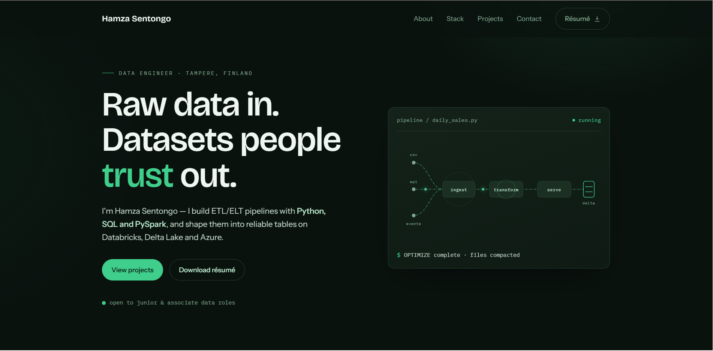

# Hamza Sentongo — Portfolio

**Live site:** [hamza-sentongo.netlify.app](https://hamza-sentongo.netlify.app)

Personal portfolio of Hamza Sentongo, an early-career data engineer in Tampere, Finland — ETL/ELT pipelines with Python, SQL and PySpark on Databricks, Delta Lake and Azure.

## Contact

- Email: hamza.sentongo@tuni.fi
- GitHub: [@HAMm-CODE](https://github.com/HAMm-CODE)
- LinkedIn: [hamza-sentongo](https://www.linkedin.com/in/hamza-sentongo-55483a243)
